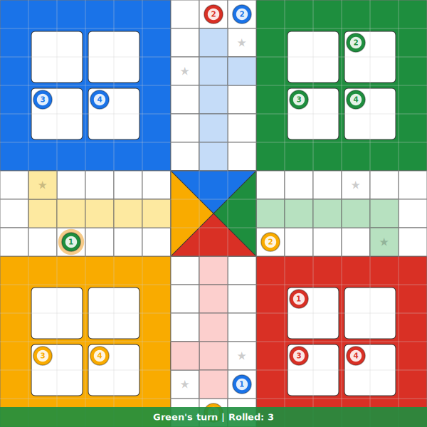

# 🎲 My Open Ludo Tournament

An open 4-player Ludo tournament where **ANYONE** can play!

<!-- END DICE ROLL -->

<!-- BEGIN LUDO BOARD -->

<!-- END LUDO BOARD -->

<!-- BEGIN TOKEN STATUS -->
| Token | red_1 | red_2 | red_3 | red_4 | blue_1 | blue_2 | blue_3 | blue_4 | green_1 | green_2 | green_3 | green_4 | yellow_1 | yellow_2 | yellow_3 | yellow_4 |
|:-----:|:--:|:--:|:--:|:--:|:--:|:--:|:--:|:--:|:--:|:--:|:--:|:--:|:--:|:--:|:--:|:--:|
| Position |🏠|🏠|🏠|🏠|🏠|🏠|🏠|🏠|🏠|🏠|🏠|🏠|🏠|🏠|🏠|🏠|
<!-- END TOKEN STATUS -->

**Click a link below to move your token!**
<!-- BEGIN MOVES LIST -->
| **Blue rolled 4 — no valid moves** | [👉 Click to pass your turn](https://github.com/noorimtiaz2004/noorimtiaz2004/issues/new?body=Please+do+not+change+the+title.+Just+click+%22Submit+new+issue%22.&title=Ludo%3A+Pass+blue) |
<!-- END MOVES LIST -->

> 🔴 Red → 🔵 Blue → 🟢 Green → 🟡 Yellow — turn order repeats. Roll a **6** to leave home base!

---

  
📜 Last 5 moves

<!-- BEGIN LAST MOVES -->
| *No moves yet!* | — |
<!-- END LAST MOVES -->

  
🏆 Top 10 players

<!-- BEGIN TOP MOVES -->
| *No moves yet!* | — |
<!-- END TOP MOVES -->

---

### How it works
1. The current dice roll is shown above
2. Click a token link → opens a GitHub Issue with the move pre-filled
3. Submit the issue — a GitHub Action moves the token, updates the board SVG, and closes the issue automatically
4. Need a **6** to bring a token out of home base
5. Land on an opponent = send them back home (★ squares are safe)
6. First player to get all 4 tokens to the centre wins 🏆
